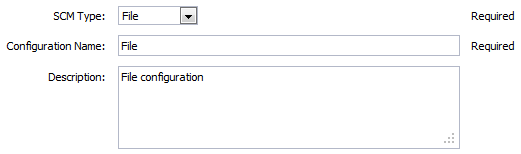
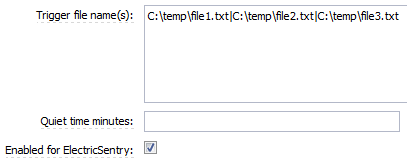

# ECSCM-File

Use this plugin with ElectricSentry to watch for changes in files.

# Plugin configuration

Plugin configurations are sets of parameters that apply across some or
all of the plugin’s procedures. They are intended to reduce repetition
of common values, create predefined sets of parameters for end users,
and to securely store credentials where needed. Each configuration is
given a unique name that is entered in designated parameters on
procedures that use them.

## Configuration parameters

<table>
<colgroup>
<col style="width: 50%" />
<col style="width: 50%" />
</colgroup>
<thead>
<tr class="header">
<th style="text-align: left;">Parameter</th>
<th style="text-align: left;">Description</th>
</tr>
</thead>
<tbody>
<tr class="odd">
<td style="text-align: left;">
SCM Type
</td>
<td style="text-align: left;">
Select the SCM Type, in this case
"File".(Required)
</td>
</tr>
<tr class="even">
<td style="text-align: left;">
Configuration Name
</td>
<td style="text-align: left;">
Provide a unique name for the
configuration, keeping in mind that you may need to create additional
configurations over time. (Required)
</td>
</tr>
<tr class="odd">
<td style="text-align: left;">
Description
</td>
<td style="text-align: left;">
You can supply a text description only
for your reference. CD does not use this information.
</td>
</tr>
</tbody>
</table>

# Plugin procedures

## Sentry schedule

This procedure is used for continuous integration. It constantly looks
for changes in a file or a set of files.

<table>
<colgroup>
<col style="width: 50%" />
<col style="width: 50%" />
</colgroup>
<thead>
<tr class="header">
<th style="text-align: left;">Parameter</th>
<th style="text-align: left;">Description</th>
</tr>
</thead>
<tbody>
<tr class="odd">
<td style="text-align: left;">
Trigger file name(s):
</td>
<td style="text-align: left;">
The full path of a file or set of files
separated by a "
</td>
</tr>
<tr class="even">
<td style="text-align: left;">
" character to be monitored.
(Required)
</td>
<td style="text-align: left;">
Quiet time minutes
</td>
</tr>
<tr class="odd">
<td style="text-align: left;">
The number of minutes of no check-in
activity required before launching the procedure.
</td>
<td style="text-align: left;">
Enabled for ElectricSentry
</td>
</tr>
</tbody>
</table>

# Release notes

## ECSCM-File 2.0.8

-   Migrated to community

## ECSCM-File 2.0.7

-   The documentation has been migrated to the main documentation site.

## ECSCM-File 2.0.6

-   Renaming to "CloudBees CD/RO"

## ECSCM-File 2.0.5

-   Renaming to "CloudBees"

## ECSCM-File 2.0.4

-   Added help link to the Sentry form.

## ECSCM-File 2.0.3

-   Monitor several files is now possible.

## ECSCM-File 2.0.2

-   Visibility for *GetSCMTag* and *Create configuration* subprocedures
    were set to private.

## ECSCM-File 2.0.1

-   Updated help page format

## ECSCM-File 2.0.0

-   Updated help page format

## ECSCM-File 1.0.2

-   Updated help page

## ECSCM-File 1.0.0

-   SCM features - Sentry

-   SCM features - Configuration
